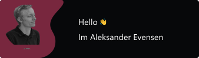

<h3>I am a self-taught programmer from Norway working on all sorts of projects</h3>

- Im currently mostly interested in systems programming with Rust, Zig, and C/C++
- I will be working on my 📚bachelor's in systems engineering in the upcoming years.
- I also love 🚀space exploration, FPV drone racing, and 🍣Japanese food

<h3 align="left">Languages and Tools:</h3>

  
  
  
  
  
  
  
   
  
  
  

